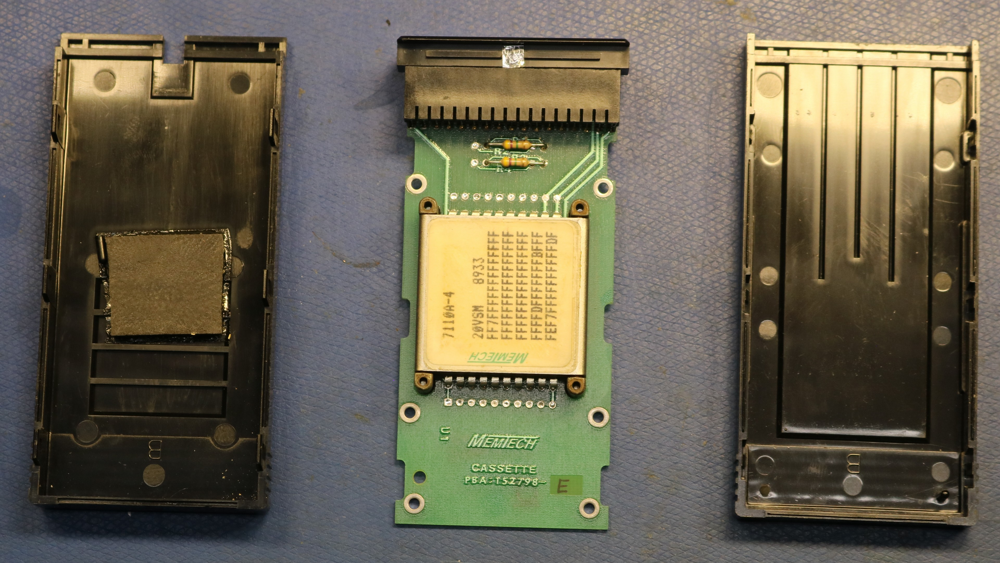
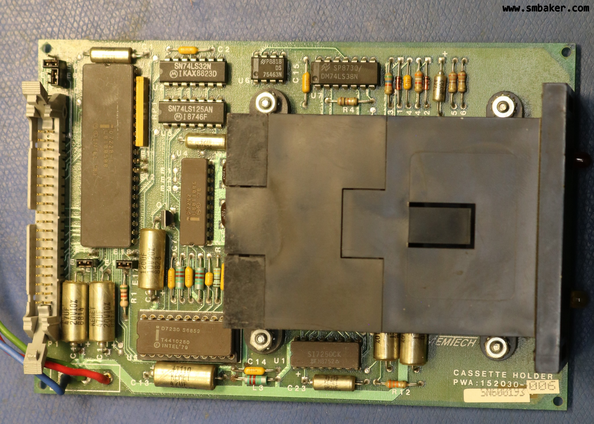

# Memtech Bubble Memory Cassette System

Scott Baker, https://www.smbaker.com/

My notes on jumper settings and stuff. I was able to use this in my iRMX-86 system 310 computer in place of an iSBX-251 multimodule board.

## Multimodule

```
Bodge on multimodule connector pin3 (GND) to pin8 (MPST). Pin8 formerly connected to U9-8.

Default Jumpers:
  E1-E2
  E4-E5

jumper pins
  E1 -> HDR-34
  E2 -> U7-5 (74ls241) driven from multimodule-MDACK
  E3 -> HDR-38

  E4 -> HDR-32
  E5 -> U8-13 (l4ls08) which together with delay line drives multimodule-MDRQT
  E6 -> HDR-37

other stuff

  Delay-IN is drive from U6-6 (74ls74)

  Multimodule-mintr0 <- u7-16 (74ls241) u7-4 <- HDR-14
  Multimodule-mintr1 <- u7-14 (74ls241) u7-6 <- HDR-12

  HDR-20 is driven via 74ls241 from multimodule-20 (MCS1)
  HDR-22 is driven via 74ls241 from multimodule-22 (MCS0)


analysis
  E1/E2/E3 and E4/E5/E6 configure DMA stuff that I don't care about.
```

## Bubble Cassette Board

```
Default Jumpers
  E5-E6
  E9-E10
  E13-E14
  E17-E18

jumper pins
  E4 -> HDR-38
  E5 -> 7220-8 (DRQ)
  E6 -> HDR-34

  E7 -> HDR-12 (mintr1)

  E8 -> U3-6 (74ls125) gated by GND input from U3-6 (74ls32) input from 7220-8 (DRQ) or 7220-9 (INT)
  E9 -> 7220-9 (INT)
  E10 -> HDR-14 (mintr0)

  E11 -> 7230-9 (PULSEEN)    - not jumpered
  E12 -> 7220-30 (BOOTSWEN)  - not jumpered

  E13 -> HDR-22 (MCS0)
  E14 -> U3-12 (74ls125) gated by GND output to 7220-21 (CS)
  E15 -> HDR-20 (MCS1)

analysis:
  E4/E5/E6 is DMA stuff that I don't care about, and seems redundant with E1/E2/E3 on the multimodule

  E8-E10 to use DRQ|INT for MINTR0, like I'm using for the SBX-251 (W6)
  E9-E10 to use INT for MINTR0, like SBX-251 W5

  E11/E12 matches W7 on the SBX-251 and is not jumpered

  E13-E14 to use chip select from MCS0
  E14-E15 to use chip select from MCS1

action taken:
  I removed E9-E10 and added E8-E10

```

## Pictures







